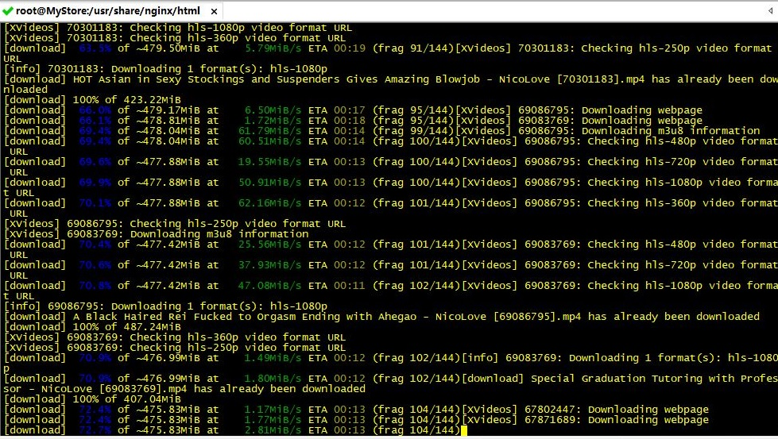
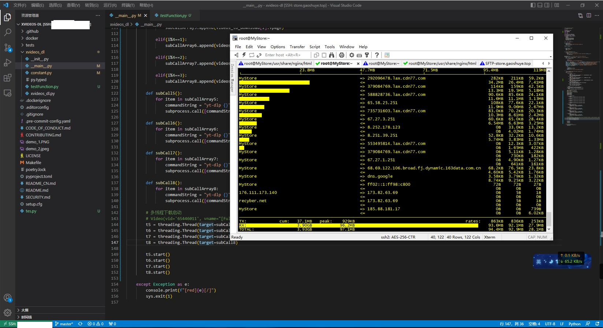

# xvideos-dl

<div align="center">

A simple tools for download Xvideo video,such as channel,model-channels and so!

Borrowed a lot of code： https://github.com/lonsty/xvideos-dl

</div>


## Features

- [X] Download a single video (requires the URL of the video playback page)
- [X] Download all videos in the favorites (requires the URL of the favorite page)
- [X] Download all videos uploaded by the user (requires the URL of the user's homepage)
- [X] Download all videos published by the channel (requires the URL of the channel homepage)
- [X] Segmented high-speed download, breakpoint download, progress and status display
- [x] Download high quality videos, 1080p or higher
- [X] Support multi-threaded downloading!!!

## Usage

⚠️**Requires:**

- `Python`: >= 3.6.1.
- python `virtual environment` ：such as anaconda.
- `Cookie`: When you run it for the first time, you will be prompted to enter the cookie, log in https://xvideos.com with your account, copy and paste a long string of cookie (there are many key-value pairs in the cookie, and `session_token=xxx` this pair must exist), then enjoy it.

Cookie is stored in `~/.xvideos/cookie` (or *C:\Users\USER\\.xvideos\cookie*).

## Recommended method

- Install `xvideos-dl` and `yt-dlp`

```bash
# install ananconda
wget https://repo.anaconda.com/archive/Anaconda3-2022.05-Linux-x86_64.sh
conda create -n downvideo python=3.8
conda activate downvideo

git clone https://github.com/yt-dlp/yt-dlp.git
cd yt-dlp && pip install .

# or
cd yt-dlp && python setup.py install --force

# install and update xVideo-DL
git clone https://github.com/SusuDOS/xVideo-DL.git
cd xVideo-DL && pip install .
```

- Get CLI help

```bash
xvideos-dl --help
```

- Download single / favorites / uploaded / published videos in one command:

```bash
xvideos-dl https://www.xvideos.com/video37177493/asian_webcam_2_camsex4u.life https://www.xvideos.com/favorite/71879935/_ https://www.xvideos.com/profiles/mypornstation https://www.xvideos.com/channels/av69tv  
```

### A simple test!
```bash
# a channel,... will store folder:therese9
https://www.xvideos.com/model-channels/therese9

# a url... will store folder:NewOthers
https://www.xvideos.com/video70766779/_
```




### notice

- It is recommended to use a command line to start a channel,such as:

```bash
# not recommended
xvideos-dl https://www.xvideos.com/model-channels/therese9 https://www.xvideos.com/amateur-channels/xreindeers

# should use this method...a channel use a command line...
nohup xvideos-dl https://www.xvideos.com/model-channels/therese9 &
nohup xvideos-dl https://www.xvideos.com/amateur-channels/xreindeers &
```

- if is not channnel ,recommend...

```bash

xvideo-dl https://www.xvideos.com/video67856135/fucked_my_wife_s_sister_-_lil_elle https://www.xvideos.com/video67010221/_ https://www.xvideos.com/video56104777/gai_xinh_them_u_cute_girl_fucking_
```